<div align="center">

</div>



**I build and break stuff 🙃**

<!--START_SECTION:waka-->


**🐱 My GitHub Data** 

> 📦 57.0 kB Used in GitHub's Storage 
 > 
> 🏆 197 Contributions in the Year 2024
 > 
> 🚫 Not Opted to Hire
 > 
> 📜 28 Public Repositories 
 > 
> 🔑 0 Private Repositories 
 > 
**I'm an Early 🐤** 

```text
🌞 Morning                55 commits          ██░░░░░░░░░░░░░░░░░░░░░░░   09.15 % 
🌆 Daytime                293 commits         ████████████░░░░░░░░░░░░░   48.75 % 
🌃 Evening                223 commits         █████████░░░░░░░░░░░░░░░░   37.10 % 
🌙 Night                  30 commits          █░░░░░░░░░░░░░░░░░░░░░░░░   04.99 % 
```
📅 **I'm Most Productive on Tuesday** 

```text
Monday                   87 commits          ████░░░░░░░░░░░░░░░░░░░░░   14.48 % 
Tuesday                  134 commits         ██████░░░░░░░░░░░░░░░░░░░   22.30 % 
Wednesday                100 commits         ████░░░░░░░░░░░░░░░░░░░░░   16.64 % 
Thursday                 112 commits         █████░░░░░░░░░░░░░░░░░░░░   18.64 % 
Friday                   50 commits          ██░░░░░░░░░░░░░░░░░░░░░░░   08.32 % 
Saturday                 69 commits          ███░░░░░░░░░░░░░░░░░░░░░░   11.48 % 
Sunday                   49 commits          ██░░░░░░░░░░░░░░░░░░░░░░░   08.15 % 
```


📊 **This Week I Spent My Time On** 

```text
🕑︎ Time Zone: America/Sao_Paulo

💬 Programming Languages: 
TypeScript               2 hrs 12 mins       █████████████░░░░░░░░░░░░   50.29 % 
JavaScript               1 hr 31 mins        █████████░░░░░░░░░░░░░░░░   34.67 % 
HTML                     33 mins             ███░░░░░░░░░░░░░░░░░░░░░░   12.50 % 
Markdown                 3 mins              ░░░░░░░░░░░░░░░░░░░░░░░░░   01.32 % 
YAML                     1 min               ░░░░░░░░░░░░░░░░░░░░░░░░░   00.58 % 

🔥 Editors: 
VS Code                  4 hrs 24 mins       █████████████████████████   100.00 % 

🐱‍💻 Projects: 
material-ui              2 hrs 45 mins       ████████████████░░░░░░░░░   62.81 % 
ReactProjects            1 hr 33 mins        █████████░░░░░░░░░░░░░░░░   35.24 % 
sans-script              5 mins              ░░░░░░░░░░░░░░░░░░░░░░░░░   01.94 % 

💻 Operating System: 
WSL                      4 hrs 24 mins       █████████████████████████   100.00 % 
```

**I Mostly Code in CSS** 

```text
JavaScript               4 repos             ███░░░░░░░░░░░░░░░░░░░░░░   12.90 % 
Python                   3 repos             ██░░░░░░░░░░░░░░░░░░░░░░░   09.68 % 
Jupyter Notebook         3 repos             ██░░░░░░░░░░░░░░░░░░░░░░░   09.68 % 
TypeScript               2 repos             ██░░░░░░░░░░░░░░░░░░░░░░░   06.45 % 
C                        1 repo              █░░░░░░░░░░░░░░░░░░░░░░░░   03.23 % 
```


 Last Updated on 06/07/2024 16:43:56 UTC
<!--END_SECTION:waka-->


##

**Work Experience**

[](https://devops.tec.br/)

**Front-end Web Developer** \
[**DevOps**](https://devops.tec.br/) • Junior \
Feb • Currently \
Languages & Technologies: `Angular17` `Tailwindcss` `TypeScript` `Node.js`

